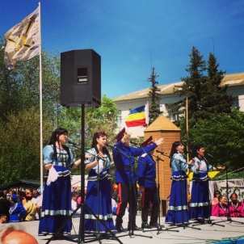
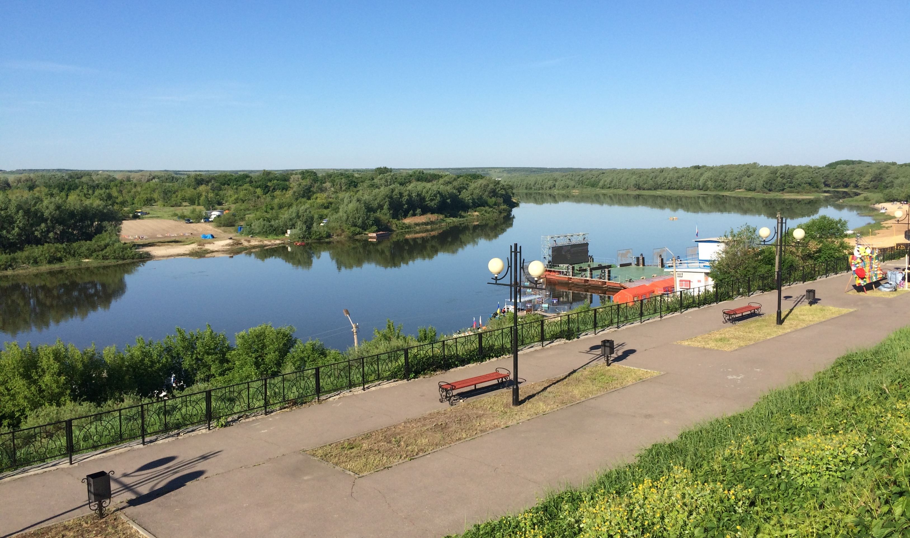
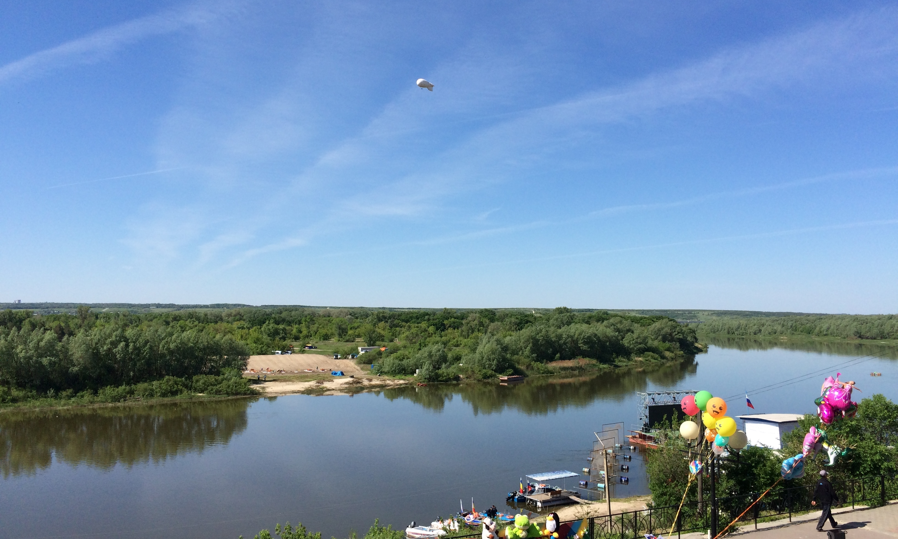
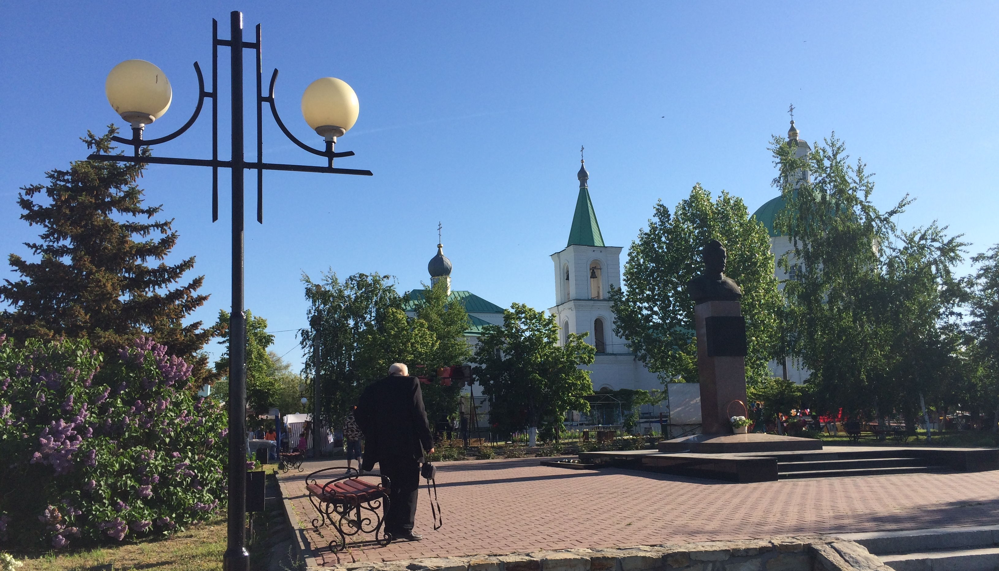
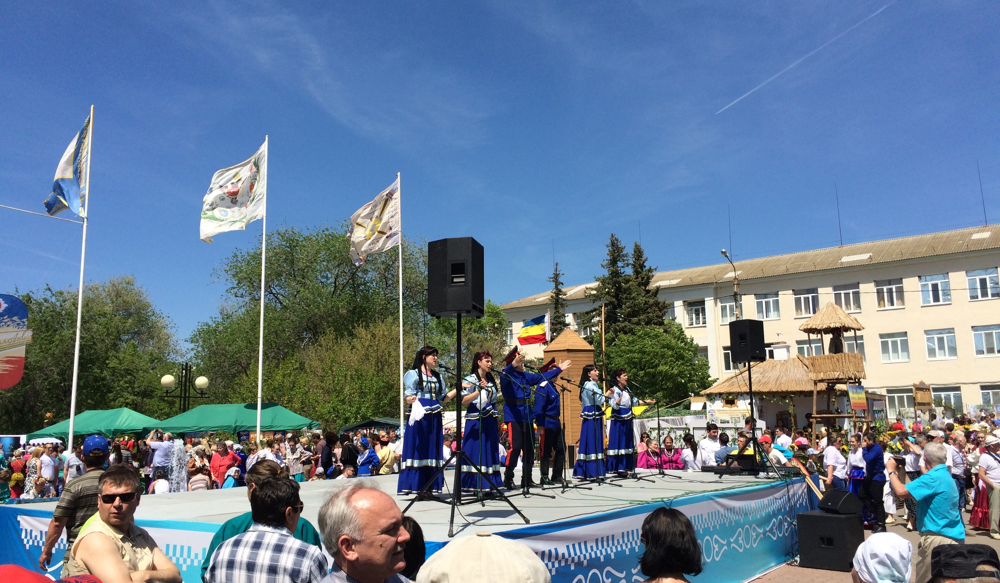
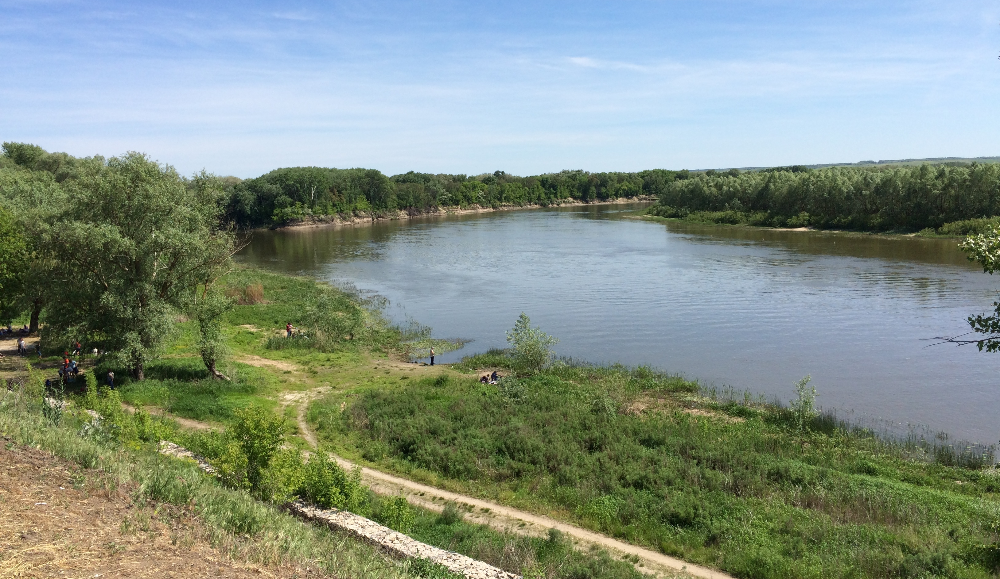
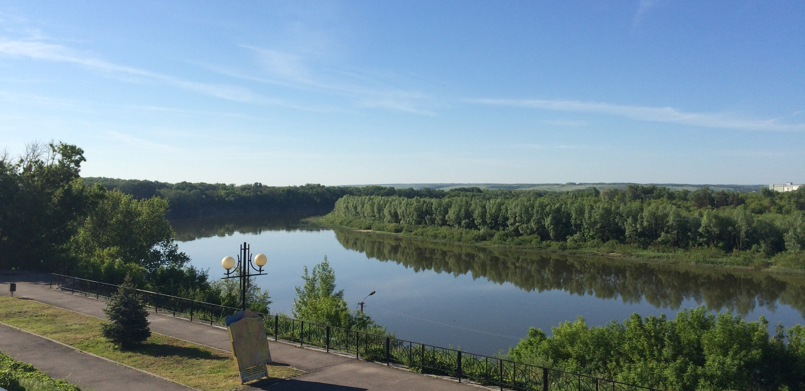

23-05-2015 | **[HTML](http://andre-y-ru.github.io/p/2015/05/23/holohov.html)** 

Вёшенская весна
================

Здравствуйте дорогой читатель моего блокнота. Сегодня, я хочу с тобой поделится своими впечатлениями от поездки на "Шолоховскую весну". Поездка наша в станицу Вёшенскую началась еще в пятницу, так как мы туда отправлялись с интересной миссией. Миссия наша состояла в том чтобы погрузить Камаз вещами и "Куреньем", а после уже по приезду разгрузить и разбить лагерь или так сказать казачий домик для участия в ежегодном конкурсе, выставке "Куреней" и концертной программе посвященной 110-летью Шолохова.

Хотелось бы с вами поделится общими впечатлениями от донского праздника. Это по настоящему добрый и правильный праздник. Почему правильный спросите вы? Да потому что здесь на празднике собираются настоящие патриоты (казаки) донского края поют песни, танцуют, выпивают и махают шашкой на гало. Чтобы прочувствовать весь дух казачества, вам необходимо приехать самим и увидеть. Обязательно нужно посетить музей Шолохова, усадьбу, набережную. В свою очередь здесь можно посетить пляж у реки Дон и покататься на катере, а вечером посмотреть салют на р.Дон.

В праздновании участвуют все казачьи районы Ростовской области. Каждый готовит своё выступление и кушанье. Здесь вам дадут выпить беленькой и закусить. Пройтись по казачий ярмарке и прикупить себе сувенир. Впечатления только положительные, ощущение что вы попали в прошлое, исконно русское и казачье. Советую всем посетить Вёшенскую весну.

п.с.: Мой краткий диалог с читателем...  

Фото Донского края (ст.Вёшенская)
--------------------------------- 

[Панорама набережной..](../../../../images/smech/holohov5.jpeg)

[&laquo; Музыка утра.](https://github.com/andre-y-ru/andre-y-ru.github.com/blob/master/p/2015/03/16/musik-utra.md) | [Ведьмак - Дикая охота &raquo;](https://github.com/andre-y-ru/andre-y-ru.github.com/blob/master/p/2015/07/03/witcher.md)

© Emelyanenko &middot; 2014-2015 · копировать нужно правильно · репозиторий на [github](https://github.com) · отдельное спасибо [Octopress](http://octopress.org)
