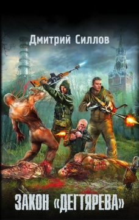
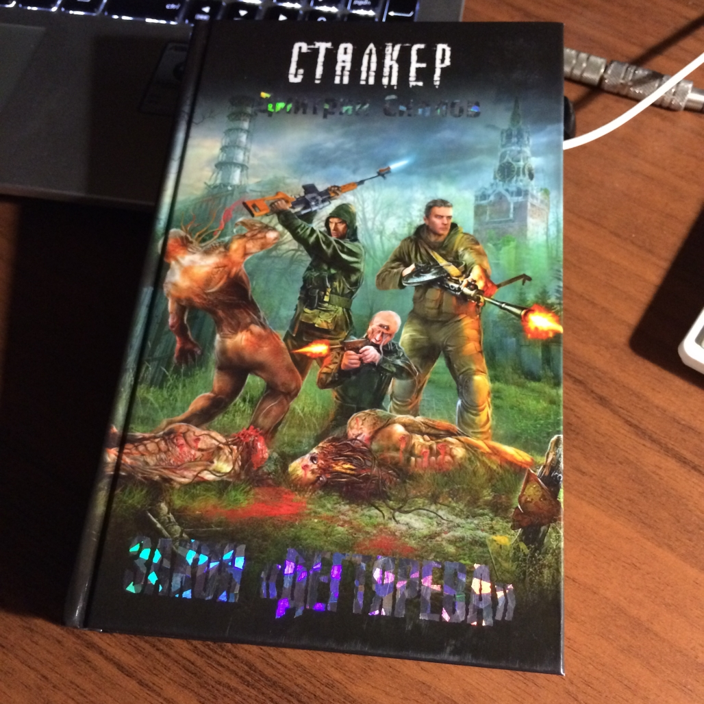
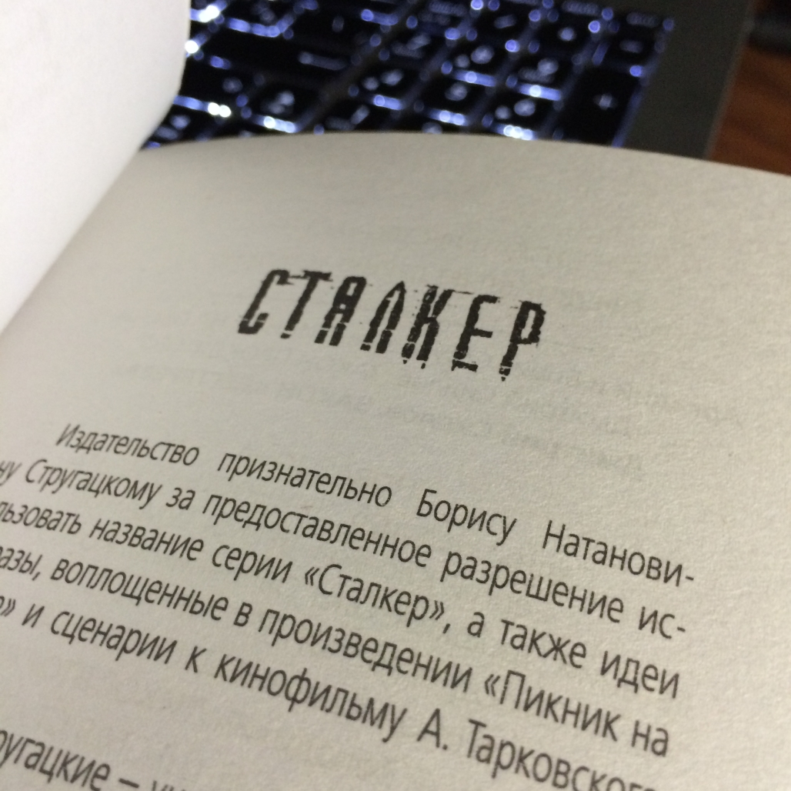
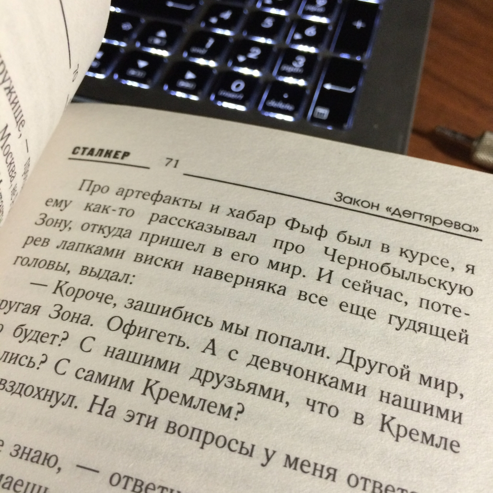

19-08-2015 | **[HTML](http://andre-y-ru.github.io/p/2015/08/19/stalker.html)** 

Сталкер - Закон Дегтярёва
===========================

Как-то раз солнечным утром проходя мимо книжного прилавка местного рынка, я спросил продавца о недавно вышедшей книге популярного издателя Дмитрия Глуховского "Метро 2035". Данной книги у него не нашлось говорит, что ещё не видел в продаже. И как следствие оказалось что, я первый кто о ней спрашивает. В наше время литературой мало кто интересуется. Я и сам в прошлом неохотно читал какие либо книги. Но не тут-то было. В процессе разговора продавец мне посоветовал почитать книги Дмитрия Силлова. Серии книг о Сталкере. Не долго думая и полистав несколько книг, моё внимание остановилось на "Законе Дегтярёва". Вот так, я и познакомился с Дмитрием Селловым.         

Содержание
----------
Признаюсь честно всё книгу, я ещё не прочитал. Но мнение о ней уже ясное и понятное. Читается она легко и не принуждённо, бегло. Сюжет, история приключения сталкера очень интересная и запоминающая. Не все книги всерьёз влезают в память, а эта даже запоминается. Такое самной было когда, я читал книгу "Ученик Ведьмака". Причитав первые две главы о том как Снайпер со своим другом мутантом (человеком) пробирается в Кремель, надеясь на то, что его все еще ждет там девушка с глазами цвета чистого неба. Можно сказать следующие, что он попал в Зону. Чернобыльскую Зону, проклятую им многократно. Зону, в которой с нетерпением ждут его старые враги, чтобы поквитаться за прошлое, и по которой все еще бродят старые друзья. Те, кто исповедует жестокий, но жизненный закон Зоны – у кого в руках пулемет Дегтярева, прокачанный артефактами, за тем и правда.    

Фото-материальчик
------------------

[&laquo; Ведьмак - Дикая охота.](https://github.com/andre-y-ru/andre-y-ru.github.com/blob/master/p/2015/07/03/witcher.md) | 

© Emelyanenko &middot; 2014-2015 · копировать нужно правильно · репозиторий на [github](https://github.com) · отдельное спасибо [Octopress](http://octopress.org)