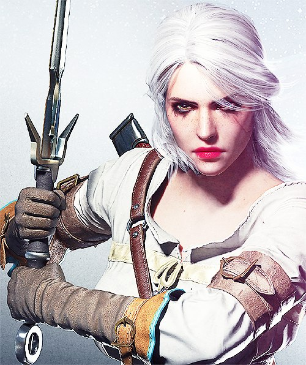
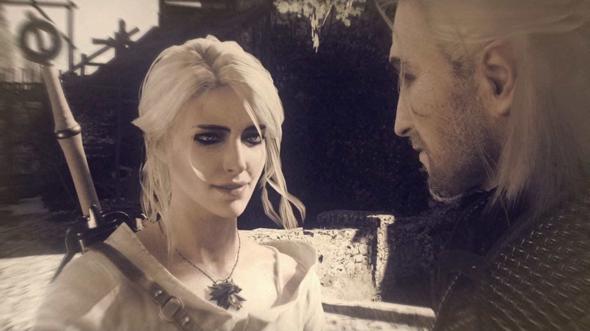
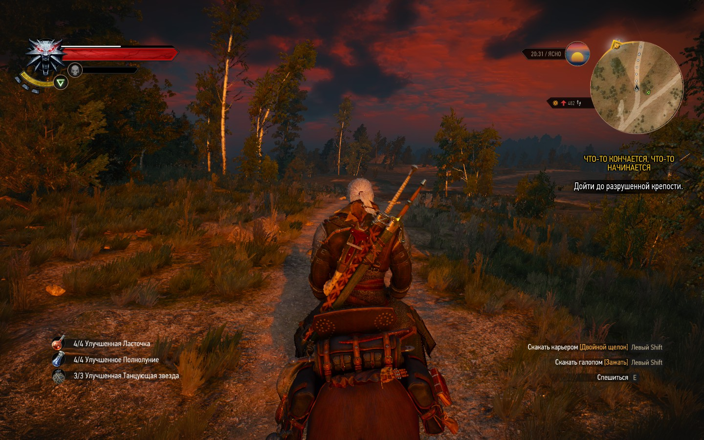
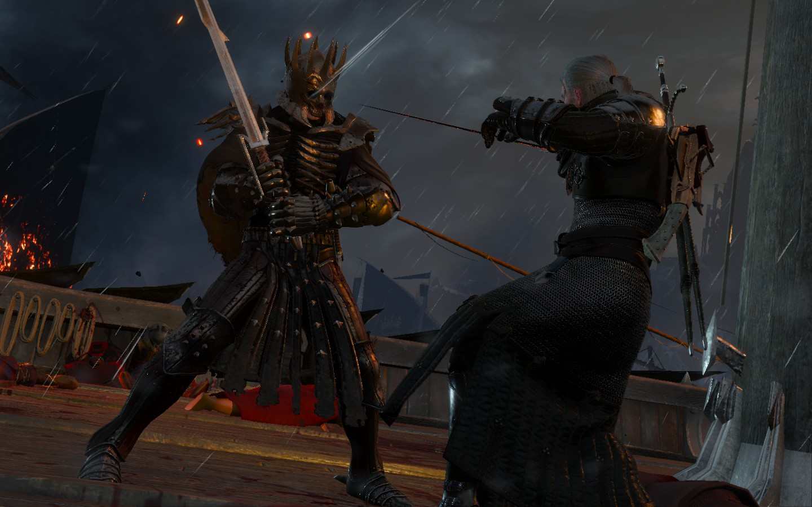

30-08-2015 | **[HTML](http://andre-y-ru.github.io/p/2015/08/30/witcher-end.html)** 

Ведьмак - конец Дикой охоте
============================

Вот и настал тот день когда приходит время конца, конца увлекательнейшей истории о Ведьмаке - дикая охота. Зираэль (Ласточка) по-моему самый непредсказуемый, харизматичный и красивый персонаж всей истории видео игр. Поэтому, он и попал на обложку этого топа. Ведьмаку уже нечего доказывать, это однозначно игра 2015 года и здесь ей нет конкурентов. Это самый думающий, сбалансированный, эпический сериал о Ведьмаке и его мире, братстве в котором он живёт. Да именно живет! Теперь у меня есть большой повод прочитать романы Анджея Сапковского. Это точно!

Сюжет
------
Ещё хотелось бы добавить то как подана сюжетная линия игры. По подобию сериала или какого нибудь блокбастера (триллера) 13 века нашей эры. Во многом мир получился живым за счёт большого количества побочных к вестов и заданий, а их тут ну очень много. И самое главное и непредсказуемое чего ещё не было, или я еще не видел в играх, это то чтобы они были так подробно проработаны. Всё побочные задания не чуть не хуже основной ветки сюжета, а даже в чём-то интереснее. Например. К вест с высшим вампиром (в морге). Где казалось бы всё очевидно, но в тоже время непредсказуемо. Но самое интересно, что все решения которые вы делаете так или иначе вам помогут или наоборот усугубят ситуацию. Примером можно привести взаимоотношение мутантов и ведьмака, в к весте где нам приходится уклонятся от огромного валуна скатившегося с горы (заговора мутантов). Где от вас зависит умрут они или нет и насколько они считаю вас добрым или злым. И в этом моменте весь Ведьмак. Где нет добра и зла а есть предатели и друзья. Доверять можно только им и больше никому, а порой приходят мысли, что они тоже не так уж верны вам. И такие моменты в игре повсюду, в плоть до самого конца. 

Суждение
---------
Мою мысль и суждение можно понять только пройдя игру от начала до конца. В общем, пожалуй Плотва самый дружелюбный и верный друг вам. Доверяйте только своему серебряному мечу и крепкому доспеху. До вас нет никому дела в этом мире каждый сам за себя. От вас зависит каким вы будете Ведьмаком.

Напоследок к выше сказанному хотелось бы дополнить. Ведьмак прежде всего книга (сюжет), история, а после уже игра.

*Самое популярное слово, которое передалось Цири от Геральта - "холера".

Фото-материальчик
------------------

С библиотекой всех скриншотов можно ознакомится (посмотреть) [здесь](http://steamcommunity.com/id/andre_y_ru/screenshots/). 

[&laquo; Сталкер - Закон Дегтярёва.](https://github.com/andre-y-ru/andre-y-ru.github.com/blob/master/p/2015/08/19/stalker.md) | 

© Emelyanenko &middot; 2014-2015 · копировать нужно правильно · репозиторий на [github](https://github.com) · отдельное спасибо [Octopress](http://octopress.org)            

   
 