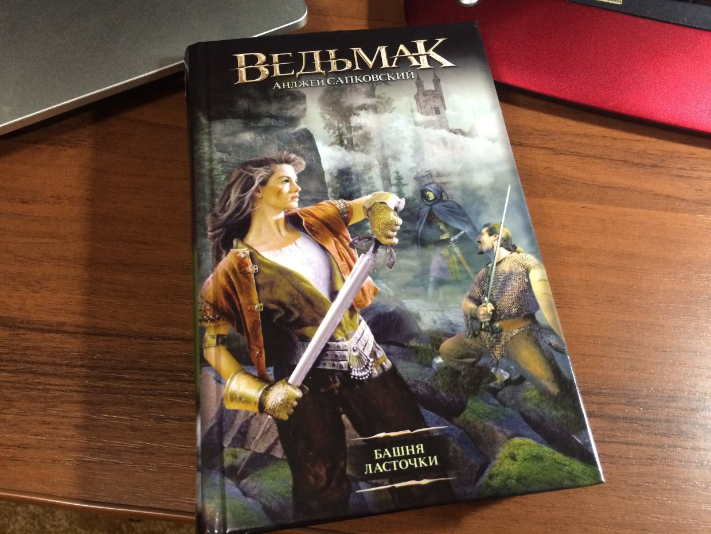
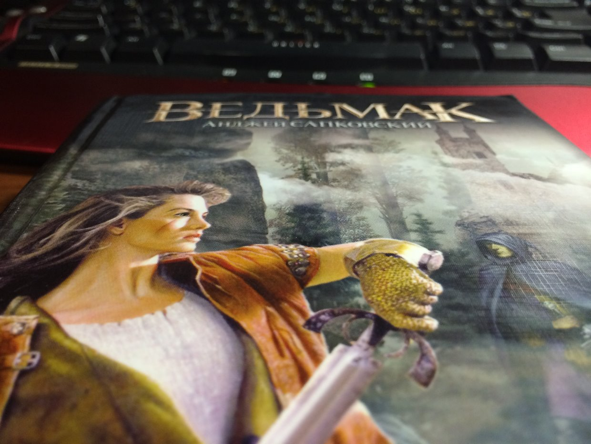
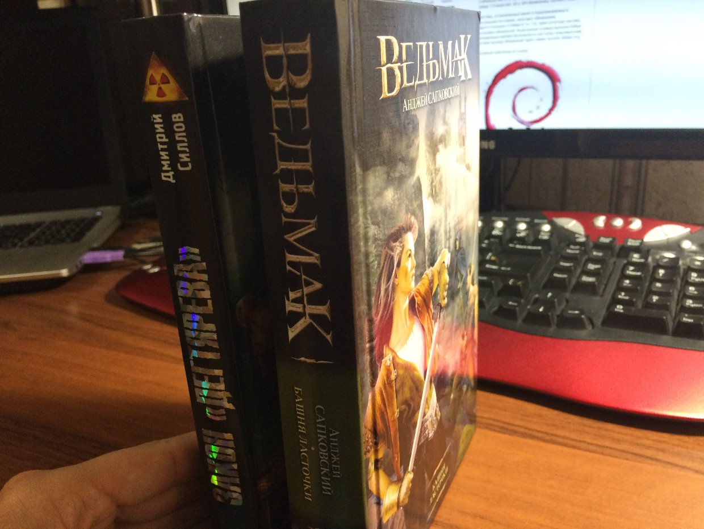

30-09-2015 | **[HTML](http://andre-y-ru.github.io/p/2015/09/30/bachna-lastochki.html)** 

Анджей Сапковский - Башня ласточки
============================

Мастер своего дела, Геральт ведьмак, могущественная чародейка Йеннифер и Дитя Предназначения Цири продолжают свой путь — сквозь кровопролитные сражения и колдовские поединки, предательские засады и вражеские чары. Весь мир — против них, но их ведет и направляет таинственная судьба. Каким-либо способом, но Дитя Предназначения должно оказаться в Башне Ласточки. 

Можно ли "опускать руки", когда кажется, что все потеряно, или нужно бороться до последнего? Захватывающий сюжет не позволит Вам оставить книгу недочитанной. Сможет ли Геральт, который поверил в смерть Цири, но продолжает искать ее похитителей, поверить в силу предназначения. А приключения Цири читаются на одном дыхании.

Предисловие
------------
Вот я и приобрёл ту самую первую книгу купленную мной историю великого и неповторимого Анджея Сапковского «Ведьмак» башня ласточки. Почему именно башня ласточки? Да потому что была только она. С неё и начнём свое путешествие. Итак не будем терять времени и приступим к чтению.. 

Фото-материальчик
------------------

[&laquo; Ведьмак - конец Дикой охоте.](https://github.com/andre-y-ru/andre-y-ru.github.com/blob/master/p/2015/08/30/witcher-end.md) | 

© Emelyanenko &middot; 2014-2015 · копировать нужно правильно · репозиторий на [github](https://github.com) · отдельное спасибо [Octopress](http://octopress.org)            

