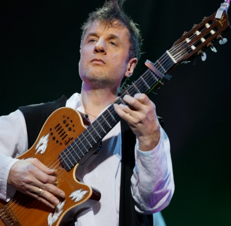

25-04-2016 | **[HTML](http://andre-y-ru.github.io/p/2017/04/25/didulya.html)** 

Дидюля - поход на концерт в Ростовскую филармонию
============================

Приезжая на очередную сессию в город Ростов-на-Дону, я и не думал, что мне посчастливиться пойти на концерт столь виртуозного гитариста, как Дидюля. Все происходило спонтанно, прогуливаясь по городу замечательно города, вдруг я увидел знакомый плакат: а именно плакат о том что 2 апреля 2017 года в Ростов приезжает Дидюля - белорусский композитор, гитарист-виртуоз и мастер своего дела в сопровождении камерного оркестра.
Не долго думая, я понял, что это шанс сходить и послушать отличную музыку и понять насколько он хорош и чего стою я. Своего рода подстегнуть себя к чему-то великому и кажется недостижимому в музыке.

Концерт получился отличным и прямо скажем запоминающимся. За время концерта кроме музыки, а именно бесконечной музыки мы как слушатели не чего не слышали, музыканты ни слова не сказал, они с нами разговаривал языком музыки и мы всё его поняли, и приняли как своего. Слов не было, был один восторг! Конечно, я как музыкант оценивал всё серьёзней чем обычный зритель. И скажу вам честно играют ребята просто суперски даже если и были фальшивые ноты, а точнее я заметил только одну и то они были выполнены на таком уровне, что они были просто сглажены в гармонии звука. Всем любителям рекомендую посетить данный концерт не пожалеете!

Историческая справка
--------------------

Дидюля - белорусский композитор, гитарист-виртуоз, лидер группы «Дидюля». Исполняет фолк-музыку и музыку в жанре фьюжн с влиянием стиля нью-эйдж.

Первую гитару Дидюля получил в пять лет в подарок от своей матери. С этого момента он начал «экспериментировать со звуком и гитарой»: ставил на гитару звукосниматель, датчик, подключал инструмент к самодельному усилителю. Вместе с друзьями посещал концерты, наблюдал, как играют на свадьбах. Позже был принят в качестве третьего гитариста в вокально-инструментальный ансамбль «Алые Зори» под руководством Николая Хитрика. Концерты проводились в разных городах, колхозах и совхозах, а позже в кооперативном ресторане. 

После распада ансамбля Дидюля занялся звукорежиссёрской работой в гродненском ансамбле песни и танца «Белые Росы», где играли, пели и танцевали в основном польские, белорусские, украинские, цыганские народные танцы и мотивы. В составе этого коллектива Дидюля впервые побывал с гастролями в Европе — в Испании, Италии, Польше, Швейцарии, Франции, Германии. В Испании он познакомился со стилем фламенко — традиционным испанским музыкально-танцевальным стилем, который и повлиял на его окончательное становление (в творчестве Дидюли отслеживаются некоторые пассажи и ритмы, характерные для фламенко и других испанских направлений, но всё же фламенко эту музыку назвать нельзя). Первый альбом Дидюли вышел в 2000 году, в 2002 году Дидюля собрал группу музыкантов и начал активную гастрольную деятельность. С первых альбомов музыкант смело экспериментирует с электронным звучанием, гитарные пассажи удачно подчёркиваются плотными и ритмичными аранжировками в стиле хаус (стоит отметить ремикс проекта Astero на композицию «Фламенко»).

Источник: [Портал «Актуальный Ростов-на-Дону»](http://arostov.com/afisha/4325)

Фотоотчёт 
--------------------------------

[&laquo; Метро 2035 - жизнь за гранью фантазии](https://github.com/andre-y-ru/andre-y-ru.github.com/blob/master/p/2016/04/16/Metro-2035.md) | [Адыгея - путешествие в один конец или туда и обратно &raquo;](https://github.com/andre-y-ru/andre-y-ru.github.com/blob/master/p/2018/02/23/adgeay.md)

© Emelyanenko &middot; 2014-2018 · копировать нужно правильно · репозиторий на [github](https://github.com)       