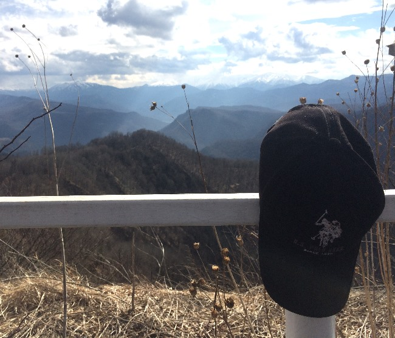
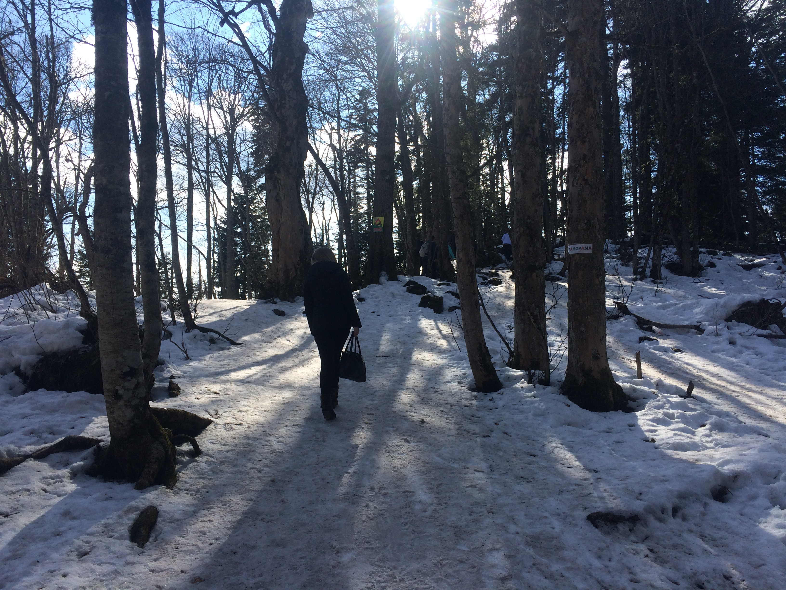
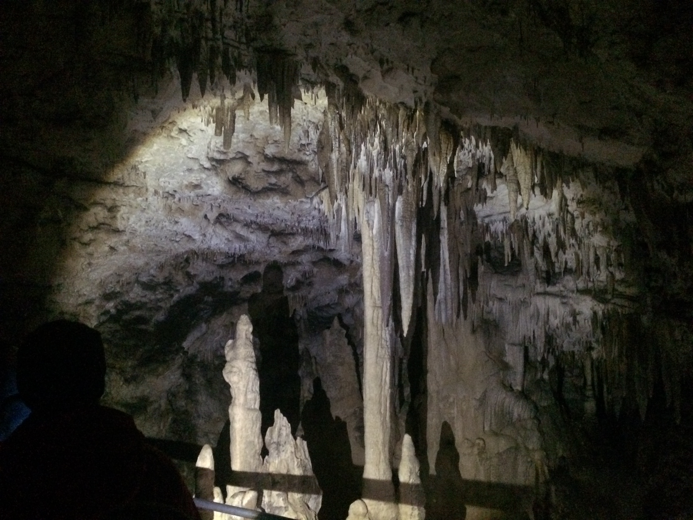
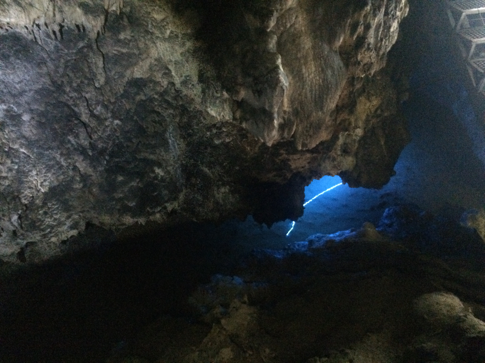
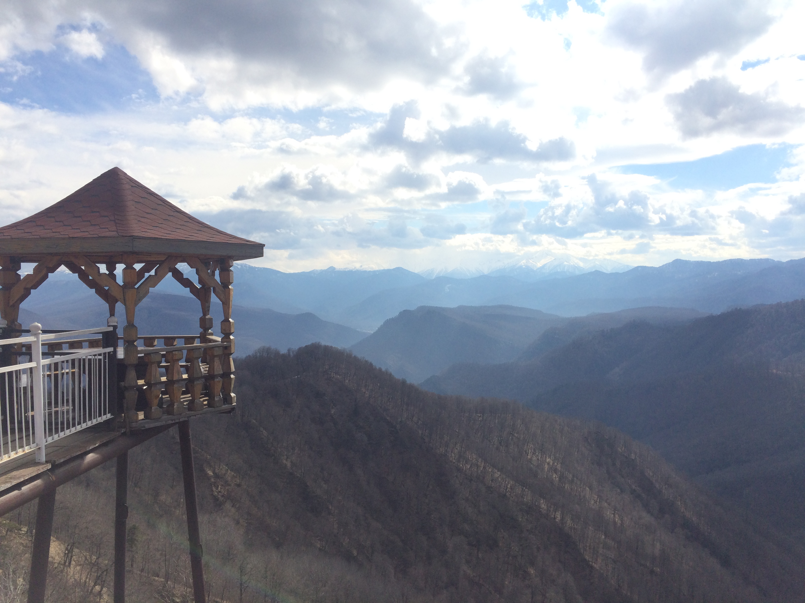
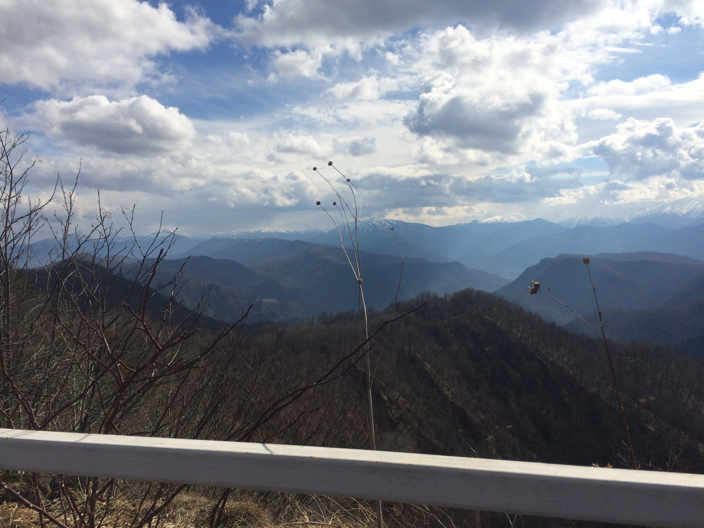
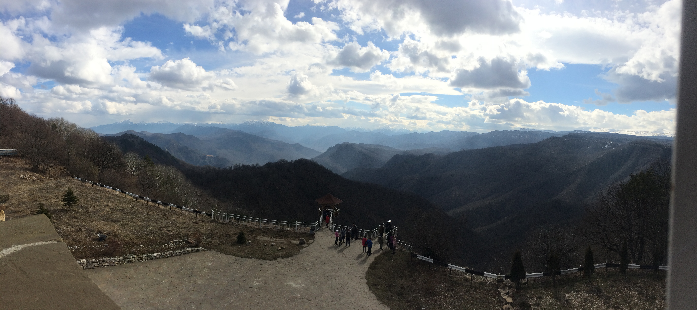

23-02-2018 | **[HTML](http://andre-y-ru.github.io/p/2018/02/23/adgeay.html)** 

Адыгея - путешествие в один конец или туда и обратно
=====================================================

**[Всем привет!](https://twitter.com/andre_y_ru)** Я уже давно здесь ничего не писал. Но вот настал тот момента когда есть что сказать. Речь пойдёт о моём путешествии в Адыгею. Скажу честно, я редко куда то так далеко езжу, но выпал шанс съездить туда куда даже и не мечтал. И я его не упустил. **[Горы вот что нужно увидеть каждому из нас.](https://yandex.ru/images/search?text=%D0%93%D0%BE%D1%80%D1%8B%20%D0%B2%D0%BE%D1%82%20%D1%87%D1%82%D0%BE%20%D0%BD%D1%83%D0%B6%D0%BD%D0%BE%20%D1%83%D0%B2%D0%B8%D0%B4%D0%B5%D1%82%D1%8C%20%D0%BA%D0%B0%D0%B6%D0%B4%D0%BE%D0%BC%D1%83%20%D0%B8%D0%B7%20%D0%BD%D0%B0%D1%81)** Потому что мы именно в горах находим то чего раньше не могли найти в обыденной жизни. А именно стремление к хорошему, чему то светлому и по настоящему величественному. Парою мы делаем ошибки которые мы не в силах исправить и именно душевное спокойствие помогает нам преодолеть все трудности и невзгоды. Горы вот ваше исцеление, они дают то что не может дать никто.

**Отправляясь в горы даже если и на один день нужно обязательно подготовиться.** Да и вообще к любому путешествию нужно готовится. Так поступил и я. Собрал рюкзак совсем необходимым, а именно: ножик, спички, фонарик, провизия, вода, телефон 2 штуки, часы, компас, тёплая одежда, удобная обувь. Пожалуй всё. Ах да, и будьте готовы к разным погодным условиям. Мне с погодой повезло, было тепло и солнечно.

**И в путь, дорогие друзья!**

- [Лаго-Наки](https://ru.wikipedia.org/wiki/Лаго-Наки) - wiki справка;
- [Яндекс.Карты](https://yandex.ru/maps/?text=%D0%B0%D0%B4%D1%8B%D0%B3%D0%B5%D1%8F%20%D0%B3%D0%BE%D1%80%D1%8B%20%D0%BB%D0%B0%D0%B3%D0%BE%D0%BD%D0%B0%D0%BA%D0%B8%20wiki&source=serp_navig&mode=search&sll=40.305296%2C44.267462&ol=biz&oid=79853241012&sspn=1.009369%2C0.415935&sctx=ZAAAAAgCEAAaKAoSCckdNpGZPUZAEfUsCOV9YEhAEhIJCD4GK061zD8RLJ56pMFtuT8iBAABAgMoBTABOPXrsZao4NjTMUDqhwZIAVXg9TE%2FWABqAnJ1cAA%3D&ll=40.317655%2C44.252658&z=11) - место на карте.                 

Есть что сказать!
--------------------
Горы это много впечатлений и эмоций которые ты раньше не испытывал. Советую всем побывать в горах! 

Фотоотчёт 
--------------------------------

[&laquo; Дидюля - поход на концерт в Ростовскую филармонию](https://github.com/andre-y-ru/andre-y-ru.github.com/blob/master/p/2017/04/25/didulya.md) | 

© Emelyanenko &middot; 2014-2018 · копировать нужно правильно · репозиторий на [github](https://github.com)       